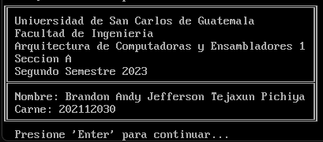
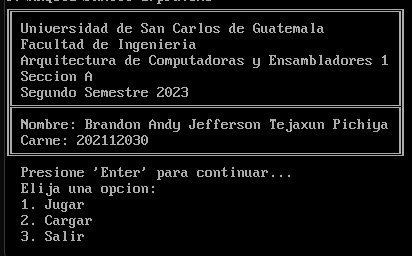
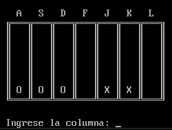
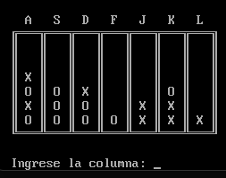

# Práctica 1 - ASM
## 1. Manual de Usuario

Al ingresar al juego se mostrará un mensaje con los datos del curso y se debe presionar *Enter* para continuar con la aplicación.
Seguidamente se mostrará un menú para acceder a las distintas funcionalidades del juego.

    
    

Al iniciar una partida del juego conect4, se solicita el nombre de los jugadores que se van a enfrentar y seguidamente comenzará el juego.

    

Al comenzar la partida se solicitará el nombre de la columna donde sea desea agregar una ficha, al momento de que un jugador logre posicionar 4 de sus fichas, ya sea de forma horizontal, vertical o diagonal, se dará por finalizada la partida y se mostrará el ganador.

    
    

## 2. Manual Técnico

### Inicialización de Datos
El código comienza con la inicialización de datos y la definición de constantes, como las fichas de los jugadores y elementos gráficos del tablero. Algunas de las constantes incluyen:

* ficha_a y ficha_b: Representan las fichas de los jugadores.
* esquina1, esquina2, esquina3, esquina4, lateral1, y lateral2: Definen elementos gráficos para el tablero.
* universidad, facultad, datos personales, entre otros.

### Segmentos y Pila
El código declara segmentos y define la pila para el programa:

* STACK: Se declara la pila para gestionar las llamadas a las subrutinas y las interrupciones del sistema.
* DATA: Inicia la sección de datos donde se definen las variables y constantes utilizadas en el programa.

### Macros y Rutinas
Se define una macro llamada print que simplifica la impresión de texto en pantalla utilizando la interrupción 21h de DOS. Esta macro se utiliza para mostrar mensajes y elementos gráficos en el juego.

### Inicio del Programa
El programa comienza con la etiqueta .STARTUP y muestra una serie de mensajes de presentación, incluyendo el nombre de la universidad, facultad, curso y nombre del estudiante.

### Menú Principal
El juego muestra un menú principal con tres opciones: Jugar, Cargar y Salir. Se lee la entrada del usuario y se procesa para determinar la opción seleccionada.

### Jugar
* El juego inicia solicitando los nombres de los jugadores.
* Muestra un tablero vacío y permite a los jugadores seleccionar una columna para colocar sus fichas.
* Se valida si alguien ha ganado o si el tablero está lleno, y se muestra un mensaje correspondiente.
* El juego continúa alternando entre los jugadores hasta que alguien gane o el tablero esté lleno.

### Funciones y Procedimientos
El código incluye varios procedimientos para realizar tareas específicas, como copiar cadenas, convertir letras en números, validar el tablero lleno, validar si alguien ha ganado, buscar un espacio vacío en una columna y obtener el valor de una casilla del tablero.

### Limpieza y Finalización
* El juego ofrece la opción de volver al menú principal o salir del programa.
* Se limpia el tablero después de cada juego.