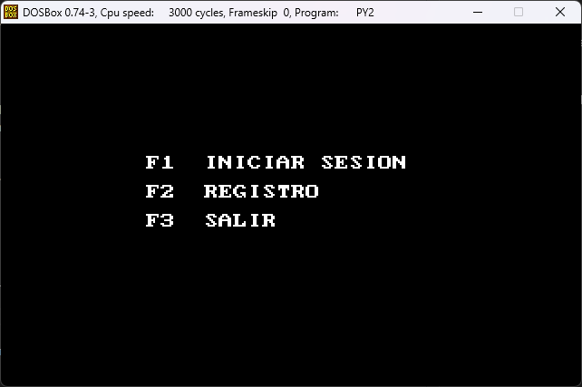
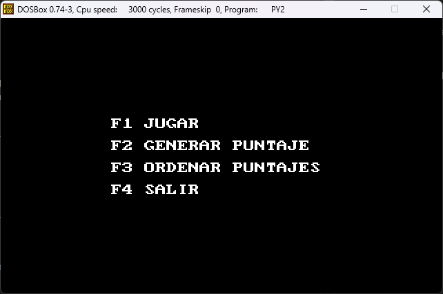
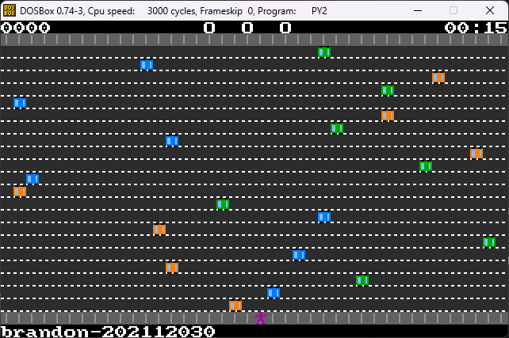
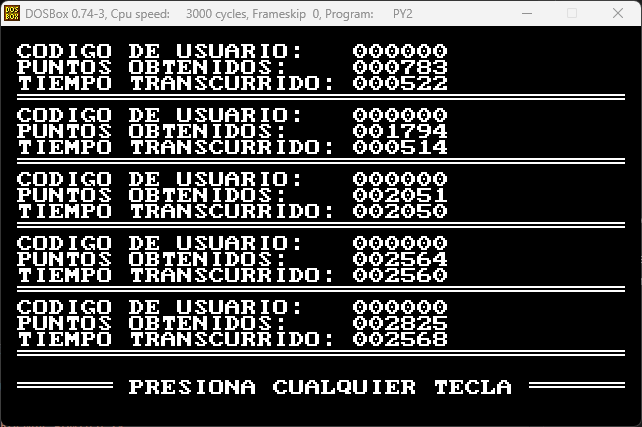
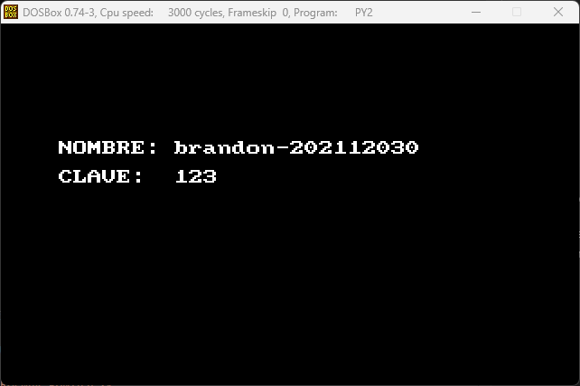

# **Proyecto 2 - ASM**
## **1. Manual de Usuario**
### Menú Principal
Al iniciar la aplicación se mostrará un menú con las funciones principales del sistema.

    

### 1.1. Iniciar Sesion

Al ingresar las credenciales correctas de un usuario previamente registrado se mostrará un nuevo menú, en el que se debe indicar la acción que se desea realizar.

    

#### 1.1.1. Jugar

Al seleccionar la opción de jugar se mostrará el mapa del juego ubicando al jugador en la acera inferior, con el objetivo de cruzar la autopista y llegar a la acera superior sin que haya una colisión con un vehiculo.

    

#### 1.1.3. Ordenar Puntajes

Muestra los puntajes obtenidos de forma ordenada

    

#### 1.1.4. Salir

Regresa el menú principal.

### 1.2. Registro

Se solicita el nombre de usuario y la contraseña para poder acceder al juego

    

## **1. Manual Técnico**
### 2.1 Menú Principal
* Descripción de la función menu_principal.
* Opciones del menú y manejo de entrada del usuario.

### 2.2 Pintar el Mapa
* Explicación de cómo se representa gráficamente el juego.
* Funciones para pintar elementos en el mapa.

### 2.3 Movimiento del Jugador
* Manejo del movimiento del jugador.
* Control de colisiones y actualización del mapa.

### 3.1 Menú Principal
* Descripción de las opciones del menú y su funcionamiento.

### 3.2 Movimiento del Jugador
* Cómo el jugador interactúa con el juego y se desplaza por el mapa.

### 3.3 Pausa y Menú de Pausa
* Cómo pausar el juego y acceder al menú de pausa.
* Opciones disponibles en el menú de pausa.